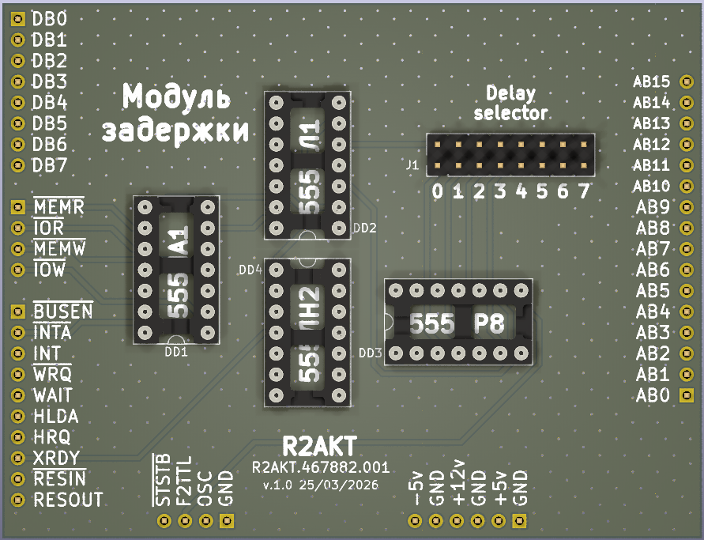

License addendum - https://github.com/R2AKT/WRQ/blob/main/Addendum.txt

# WRQ

Wait state insertion module. For Mega-80 (Mega-580) DIY 8-bit micro-computer - https://github.com/R2AKT/Mega-80.

Generation of a CPU module 'Wait' signal upon request from a slow device.

Status: Under testing.

Модуль задержки. Для подключения к процессорной плате CPU_8080 - https://github.com/R2AKT/CPU_8080.

Генерация по запросу от медленного устройства сигнала торможения процессорного модуля.

Статус: В стадии тестирования.
